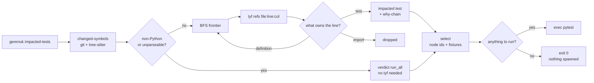
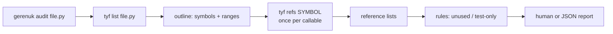

# How it works

`gerenuk` is a test-selection pipeline, plus an auditor that reads the same
reference graph backwards.

## The selection pipeline

[`changed-symbols`](commands/changed-symbols.md) parses Python itself, with
`tree-sitter-python`, and needs nothing but `git` — so the first stage works in
a checkout that has never had `ty` installed.

[`impacted-tests`](commands/impacted-tests.md) adds the second source: `tyf`,
which asks `ty`'s language server for the references, and does the real name
resolution. It walks that graph outwards from the changed symbols until it
reaches test code.

[`run`](commands/run.md) adds a third source that is neither: the test files
themselves, parsed for pytest's collection conventions and for the fixture
edges pytest resolves by *name* — which no type checker can follow. It then
execs pytest.

## The audit pipeline

For [`audit`](commands/audit.md), `gerenuk` does no parsing of its own at all —
it asks `tyf` for the file's outline and then for each symbol's references.

Step by step:

1. **Outline.** `tyf --format json list <file>` returns an LSP document
   outline: every symbol in the file, its kind, and its ranges.
2. **Select.** `analyze::auditable_symbols` flattens that outline and keeps the
   callable, non-underscore symbols. Methods become dotted names
   (`ShelterService.seniors`) so `tyf` can resolve them unambiguously.
3. **Resolve.** One `tyf --format json refs <symbol>` per selected symbol,
   yielding production and test reference lists.
4. **Classify.** `analyze::audit` applies the rules — see
   [Two corrections gerenuk applies](#two-corrections-gerenuk-applies) below.
5. **Render.** `report::Report` writes human lines or one JSON object.

## Two corrections gerenuk applies

`tyf`'s answers need two adjustments before the rules can use them.

**The buckets are re-derived from paths.** `tyf` splits references into
production and test lists using its own heuristic, which inspects the whole
absolute path. A project living under a directory named `tests/` — gerenuk's
own fixture package does — has *every* reference filed as a test. `gerenuk`
therefore re-classifies each reference itself, against a path made relative to
the workspace root first.

That only works when the lists are complete, so `gerenuk` calls
`tyf refs <symbol> --tests --references-limit 0`: `--tests` populates
`test_references` (withheld by default) and `--references-limit 0` disables
truncation. When the lists still come back shorter than the reported counts,
`gerenuk` falls back to `tyf`'s own counts — imperfect buckets and all — rather
than reading a withheld list as zero references.

**The definition is not a usage.** `tyf` includes the symbol's own definition
among the references. Counting it would mean nothing is ever unreferenced, so
`gerenuk` drops the reference that lands on the definition's line.

## Module layout

| Module | Responsibility |
|---|---|
| `cli` | Argument parsing and command bodies |
| `tyf` | Spawning `tyf`, decoding its JSON — one of three impure modules |
| `git` | Spawning `git` — the second |
| `pytest` | Exec'ing pytest — the third, and it only execs ([ADR 0011](https://github.com/mojzis/gerenuk/blob/main/docs/adr/0011-a-third-seam-that-only-execs.md)) |
| `model` | Wire types for what `tyf` emits |
| `workspace` | Project-root detection, test-path heuristic |
| `analyze` | The `audit` rules — pure, given parsed data |
| `diff` | Unified-diff text → per-file line ranges |
| `pysource` | Tree-sitter symbol extraction: which symbol owns a line |
| `modpath` | File path → dotted module path |
| `config` | `[tool.gerenuk]` in `pyproject.toml` |
| `changed` | Diff plus sources → the `changed-symbols` report |
| `closure` | BFS over the reverse reference graph — pure, behind two traits |
| `impact` | `tyf` and the working tree behind those traits; the impact report |
| `fixtures` | pytest's fixture map and collection conventions — pure |
| `select` | Impact report plus the working tree → pytest node ids — pure |
| `report` | Human and JSON rendering |

`tyf::Runner::run`, `git::Git::run` and `pytest::Runner::exec` are the only
functions that spawn a process. Everything downstream takes already-parsed
values, which is why the analysis and rendering tests need no `tyf`, no `ty`,
no `git`, no pytest and no Python: the integration tests stub `tyf` and pytest
with shell scripts and set `GERENUK_TYF` and `GERENUK_PYTEST`, and `changed`'s
unit tests substitute a `HashMap` for the `changed::Sources` trait.

The third seam is a different shape from the other two, which is why it was
allowed. It is exec-and-replace rather than run-and-parse: gerenuk's process
*becomes* pytest, so there is nothing to capture and no caller left to return
to.

## Why dotted names

`tyf refs summary` would match every `summary` in the project. `tyf refs
ShelterService.summary` narrows to the method. `gerenuk` builds those dotted
names from the outline's nesting, so class members are resolved correctly
without gerenuk knowing anything about Python scoping.
